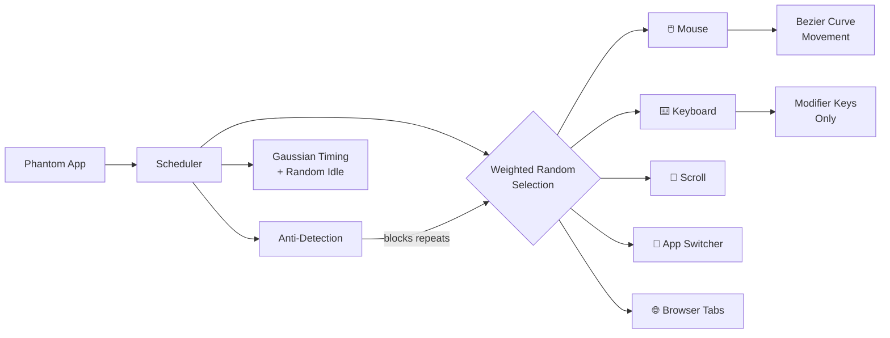
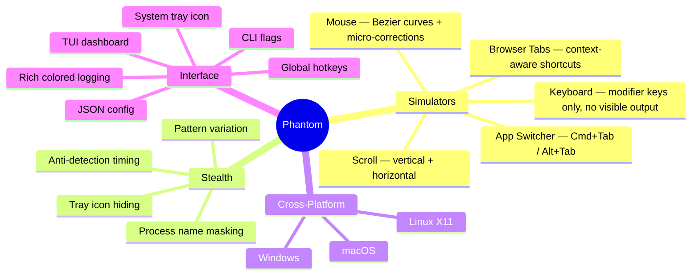
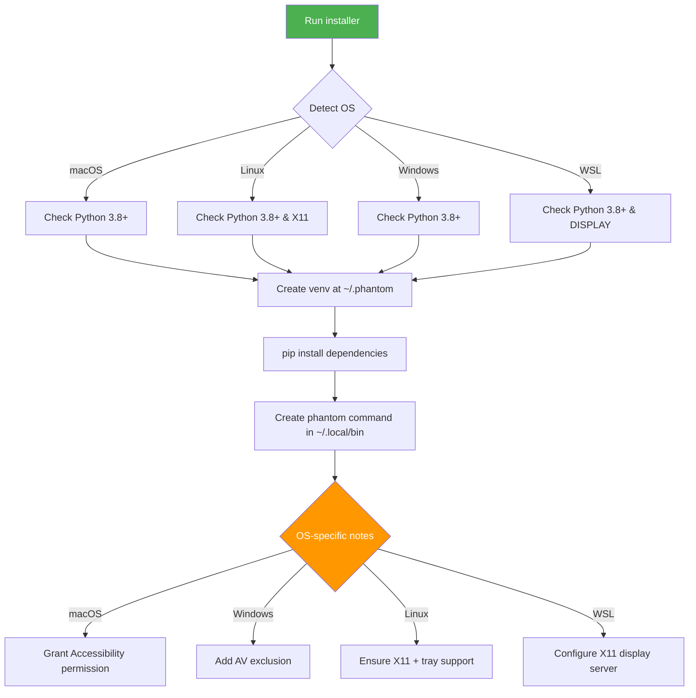
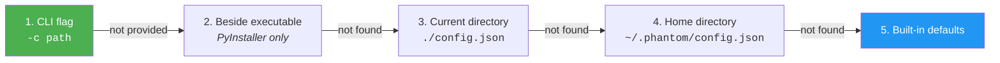
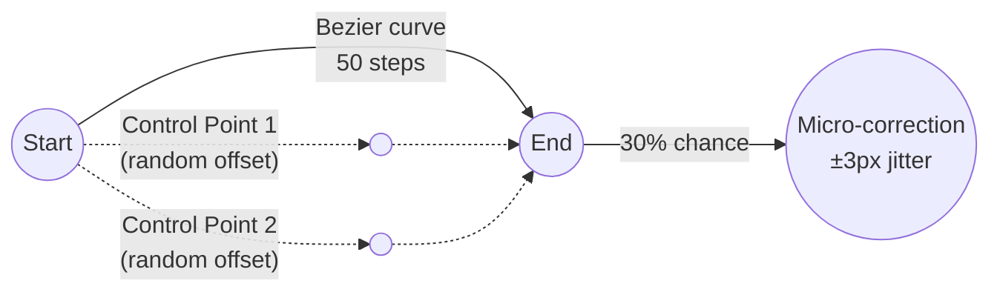
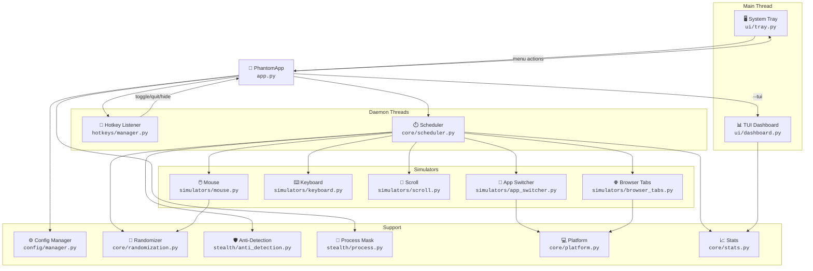
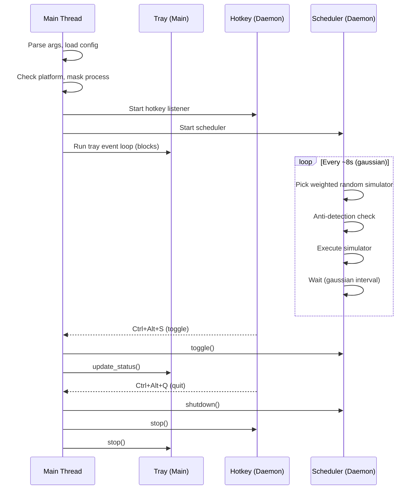

<p align="center">
  
  
  
  
  
  
</p>

<h1 align="center">Phantom</h1>

<p align="center">
  <strong>Cross-platform activity simulator that keeps your computer looking busy.</strong>
</p>

<p align="center">
  Realistic mouse movements &bull; Keyboard activity &bull; Scrolling &bull; App switching &bull; Browser tabs<br/>
  Stealth mode &bull; System tray &bull; TUI dashboard &bull; Global hotkeys &bull; Fully configurable
</p>

---

## Table of Contents

- [How it Works](#how-it-works)
- [Features](#features)
- [Installation](#installation)
- [Usage](#usage)
- [Platform Setup](#platform-setup)
  - [macOS](#-macos)
  - [Windows](#-windows)
  - [Linux](#-linux)
- [Configuration](#configuration)
- [Architecture](#architecture)
- [Building](#building)
- [Testing](#testing)
- [Contributing](#contributing)
- [License](#license)

---

## How it Works



Phantom's scheduler runs in a daemon thread, picking a random simulator on each cycle. The selection is **weighted** — higher weight means chosen more often. Timing follows a **normal distribution** with configurable mean/stddev, plus random **idle periods** that mimic natural breaks. An **anti-detection** system prevents repetitive patterns (e.g., same action 4+ times in a row, or alternating A-B-A-B sequences).

---

## Features



| Simulator | What it does | Default Weight |
|-----------|-------------|----------------|
| **Mouse** | Moves cursor along randomized cubic Bezier curves with 30% chance of micro-correction jitter at the end | `40` |
| **Keyboard** | Presses modifier keys (Shift, Ctrl, Alt) + CapsLock double-tap — produces **no visible output** | `30` |
| **Scroll** | Vertical scrolling (90%) or horizontal scrolling (10%), random direction and amount | `15` |
| **App Switcher** | Simulates Cmd+Tab (macOS) or Alt+Tab (Windows/Linux) to switch 1-3 apps | `10` |
| **Browser Tabs** | Context-aware tab switching — detects the active app and sends the correct shortcut (e.g. Cmd+Shift+] for browsers on macOS, Ctrl+Tab for VS Code). Falls back to Ctrl+Tab when detection is unavailable | `5` |

---

## Installation

### Quick Install

```bash
# PyPI (all platforms)
pipx install go-phantom

# Homebrew (macOS)
brew install hammadxcm/go-phantom/phantom

# Snap (Linux)
sudo snap install go-phantom

# Chocolatey (Windows)
choco install go-phantom

# WinGet (Windows)
winget install hammadxcm.go-phantom

# Scoop (Windows)
scoop bucket add phantom https://github.com/hammadxcm/scoop-phantom
scoop install go-phantom

# Download binary from GitHub Releases
# macOS: phantom-macos-arm64
# Linux: phantom-linux-x86_64 or phantom_0.0.3_amd64.deb
# Windows: phantom-windows.exe
```

| Platform | Method | Install | Run |
|----------|--------|---------|-----|
| All | PyPI | `pipx install go-phantom` | `phantom` |
| macOS | Homebrew | `brew install hammadxcm/go-phantom/phantom` | `phantom` |
| Linux | Snap | `sudo snap install go-phantom` | `phantom` |
| Linux | .deb | `sudo dpkg -i phantom_*.deb` | `phantom` |
| Windows | Chocolatey | `choco install go-phantom` | `phantom` |
| Windows | WinGet | `winget install hammadxcm.go-phantom` | `phantom` |
| Windows | Scoop | `scoop install go-phantom` | `phantom` |
| Any | Binary | Download from [Releases](https://github.com/hammadxcm/go-phantom/releases) | `./phantom` |

### One-command install (from source)

Both installers are **fully cross-platform** — use whichever you prefer on any OS:

<table>
<tr>
<th>Method</th>
<th>Command</th>
<th>Works on</th>
</tr>
<tr>
<td><strong>Bash</strong></td>
<td>

```bash
git clone https://github.com/hammadxcm/go-phantom.git && cd phantom && ./install.sh
```

</td>
<td>macOS, Linux, Windows (Git Bash / WSL / MSYS2)</td>
</tr>
<tr>
<td><strong>PowerShell</strong></td>
<td>

```powershell
git clone https://github.com/hammadxcm/go-phantom.git; cd phantom; .\install.ps1
```

</td>
<td>Windows, macOS (pwsh), Linux (pwsh)</td>
</tr>
<tr>
<td><strong>CMD</strong></td>
<td>

```cmd
git clone https://github.com/hammadxcm/go-phantom.git && cd phantom && install.bat
```

</td>
<td>Windows (Command Prompt)</td>
</tr>
<tr>
<td><strong>Make</strong></td>
<td>

```bash
git clone https://github.com/hammadxcm/go-phantom.git && cd phantom && make setup
```

</td>
<td>macOS, Linux, Windows (Git Bash / MSYS2)</td>
</tr>
</table>



The installer automatically:
1. Detects your OS and checks prerequisites (Python 3.8+, X11 on Linux, DISPLAY on WSL)
2. Creates an isolated virtual environment at `~/.phantom/`
3. Installs all dependencies
4. Creates OS-appropriate launcher scripts:
   - **macOS / Linux**: `~/.local/bin/phantom` (bash)
   - **Windows**: `phantom.cmd` (CMD) + `phantom.ps1` (PowerShell)
   - **Git Bash on Windows**: all three launchers
5. Checks PATH and shows how to add it if needed

After install, just run:

```bash
phantom          # start with defaults
phantom -v       # start with debug logging
```

### Manual install (advanced)

```bash
git clone https://github.com/hammadxcm/go-phantom.git
cd phantom

python3 -m venv .venv
source .venv/bin/activate   # macOS/Linux
# .venv\Scripts\activate    # Windows

pip install -e .
python -m phantom
```

### Pre-built binary

```bash
pip install -e ".[dev]"     # Install PyInstaller
make build                  # Outputs: dist/phantom
./dist/phantom              # Run standalone (no Python needed)
```

### Uninstall

```bash
make uninstall              # Removes ~/.phantom and phantom command
```

### Dependencies

All installed automatically — no manual setup needed:

| Package | Purpose |
|---------|---------|
| `pynput` | Global hotkeys and keyboard control |
| `pyautogui` | Mouse movement and scrolling |
| `pystray` | System tray icon |
| `Pillow` | Tray icon image generation |
| `setproctitle` | Process name masking |
| `rich` | TUI dashboard and colored logging |

---

## Usage

### Quick Start

```bash
phantom                    # run with defaults (mouse + keyboard + scroll)
phantom --tui              # TUI dashboard mode
phantom -v                 # debug logging
phantom -c ~/config.json   # custom config file
```

### Run Individual Simulators

```bash
# Single simulator
phantom --mouse-only           # mouse movement only
phantom --keyboard-only        # keyboard modifier keys only
phantom --scroll-only          # scroll wheel only

# Pick exactly which simulators to run
phantom --only mouse,scroll              # mouse + scroll, nothing else
phantom --only keyboard,browser_tabs     # keyboard + tab switching
phantom --only app_switcher              # app switching only (Cmd/Alt+Tab)

# Add to defaults (mouse + keyboard + scroll are on by default)
phantom --enable app_switcher            # add app switching
phantom --enable app_switcher,browser_tabs  # add both

# Remove from defaults
phantom --disable scroll                 # no scrolling
phantom --disable mouse,keyboard         # scroll only

# Enable everything
phantom --all                            # all 5 simulators active
```

### Timing Control

```bash
# Fast mode — action every ~3 seconds
phantom --interval 3.0

# Slow mode — action every ~20 seconds with high variance
phantom --interval 20.0 --interval-stddev 10.0

# No idle pauses (continuous activity)
phantom --idle-chance 0

# Lots of idle pauses (25% chance each cycle)
phantom --idle-chance 0.25
```

### Simulator Tuning

```bash
# Mouse: small, smooth movements
phantom --mouse-only --mouse-distance 20 100 --mouse-speed 150

# Mouse: large, fast movements
phantom --mouse-only --mouse-distance 200 800 --mouse-speed 30

# Keyboard: single key press per action
phantom --keyboard-only --key-presses 1

# Scroll: gentle scrolling (1-2 clicks)
phantom --scroll-only --scroll-clicks 1 2

# Scroll: aggressive scrolling (5-10 clicks)
phantom --scroll-only --scroll-clicks 5 10
```

### Weight Control

Weights control how often each simulator is picked. Higher = more frequent.

```bash
# Mouse-heavy (80% mouse, 20% keyboard)
phantom --only mouse,keyboard --mouse-weight 80 --keyboard-weight 20

# Equal distribution across all simulators
phantom --all --mouse-weight 20 --keyboard-weight 20 --scroll-weight 20 \
  --app-switcher-weight 20 --browser-tabs-weight 20

# Mostly scrolling with some mouse
phantom --only mouse,scroll --scroll-weight 70 --mouse-weight 30
```

### Stealth Options

```bash
# Maximum stealth (rename process + hide tray icon)
phantom --stealth

# Custom process name
phantom --process-name "WindowServer"

# No stealth at all
phantom --no-stealth
```

### Custom Hotkeys

```bash
# Change toggle and quit hotkeys
phantom --hotkey-toggle "<ctrl>+<shift>+f9" --hotkey-quit "<ctrl>+<shift>+f10"

# Change all hotkeys
phantom --hotkey-toggle "<ctrl>+<alt>+p" \
        --hotkey-quit "<ctrl>+<alt>+x" \
        --hotkey-hide "<ctrl>+<alt>+i"
```

### Combined Examples

```bash
# Presentation mode: subtle mouse + no idle + stealth + TUI
phantom --mouse-only --mouse-distance 20 200 --interval 5.0 \
        --idle-chance 0 --stealth --tui

# Work simulation: all simulators, relaxed timing, custom hotkeys
phantom --all --interval 15.0 --idle-chance 0.20 \
        --hotkey-toggle "<ctrl>+<shift>+s"

# Quick test: fast keyboard + scroll, verbose logging
phantom --only keyboard,scroll --interval 2.0 -v

# Screen-lock prevention: minimal mouse movement every 30 seconds
phantom --mouse-only --interval 30.0 --interval-stddev 5.0 \
        --mouse-distance 10 50 --idle-chance 0 --no-stealth
```

### Using Make Targets

```bash
make run           # tray mode (defaults)
make tui           # TUI dashboard
make run-verbose   # debug logging
```

### TUI Dashboard

The `--tui` flag launches a rich terminal dashboard instead of the system tray:

```
┌──────────────────────────────────────────────────┐
│  PHANTOM   RUNNING         Uptime: 00:14:32      │
├─────────────────────┬────────────────────────────┤
│  Stats              │  Live Logs                 │
│  ─────────────      │  17:04:50 Mouse → (694…    │
│  Mouse        12    │  17:04:55 Keyboard 2 …     │
│  Keyboard      8    │  17:04:58 Scroll 3 cl…     │
│  Scroll        5    │  17:05:03 Mouse → (12…     │
│  App Switch    3    │  17:05:10 Idle 23.4s       │
│  Browser       1    │  17:05:33 Mouse → (45…     │
│  ─────────────      │                            │
│  Total        29    │                            │
│  Last: Mouse        │                            │
├─────────────────────┴────────────────────────────┤
│  [S] Toggle  [Q] Quit                            │
└──────────────────────────────────────────────────┘
```

> **Note:** TUI mode and system tray are mutually exclusive. The `--tui` flag runs the dashboard on the main thread; without it, the system tray runs instead.

### CLI Reference

Run `phantom --help` to see all options. Key flags:

| Flag | Description |
|------|-------------|
| `-c`, `--config` | Path to config.json |
| `-v`, `--verbose` | Debug logging |
| `--tui` | TUI dashboard mode |
| `--mouse-only` | Mouse simulator only |
| `--keyboard-only` | Keyboard simulator only |
| `--scroll-only` | Scroll simulator only |
| `--only SIMS` | Comma-separated simulators |
| `--enable SIMS` | Add simulators to defaults |
| `--disable SIMS` | Remove simulators |
| `--all` | Enable all 5 simulators |
| `--interval SEC` | Mean action interval |
| `--idle-chance P` | Idle probability (0-1) |
| `--mouse-distance MIN MAX` | Movement range (px) |
| `--mouse-speed STEPS` | Bezier smoothness |
| `--key-presses MAX` | Max keys per action |
| `--scroll-clicks MIN MAX` | Scroll range |
| `--mouse-weight W` | Mouse frequency weight |
| `--stealth` | Max stealth mode |
| `--no-stealth` | Disable stealth |
| `--process-name NAME` | Custom process name |
| `--hotkey-toggle KEYS` | Toggle hotkey |
| `--hotkey-quit KEYS` | Quit hotkey |

### Global Hotkeys

| Hotkey | Action | Description |
|--------|--------|-------------|
| <kbd>Ctrl</kbd>+<kbd>Alt</kbd>+<kbd>S</kbd> | **Toggle** | Start or pause simulation |
| <kbd>Ctrl</kbd>+<kbd>Alt</kbd>+<kbd>Q</kbd> | **Quit** | Gracefully exit Phantom |
| <kbd>Ctrl</kbd>+<kbd>Alt</kbd>+<kbd>H</kbd> | **Hide** | Toggle tray icon visibility |

### System Tray

When running, Phantom shows a system tray icon with a right-click menu:

```
┌─────────────────┐
│ ▶ Start/Pause   │
│ ─────────────── │
│ ✕ Quit          │
└─────────────────┘
```

### Example Session

```bash
$ python -m phantom -v

14:13:44 [INFO] phantom.config.manager: No config file found, using defaults
14:13:44 [WARNING] phantom.core.platform: macOS requires Accessibility permission...
14:13:45 [INFO] phantom.stealth.process: Process renamed to 'system_service'
14:13:45 [INFO] phantom.hotkeys.manager: Hotkeys registered: toggle=<ctrl>+<alt>+s, quit=<ctrl>+<alt>+q
14:13:45 [INFO] phantom.core.scheduler: Simulation loop started
14:13:45 [INFO] phantom.app: Phantom started. Press <ctrl>+<alt>+s to toggle.
14:13:47 [DEBUG] MouseSimulator: Mouse moved to (1474, 829)
14:13:52 [DEBUG] KeyboardSimulator: Keyboard: 2 modifier presses
14:13:58 [DEBUG] ScrollSimulator: Scroll: 3 clicks, direction=1
14:14:05 [DEBUG] MouseSimulator: Mouse moved to (892, 341)
14:14:13 [DEBUG] Idle period: 23.4s
```

---

## Platform Setup

### 🍎 macOS

<details>
<summary><strong>Click to expand macOS setup instructions</strong></summary>

#### Prerequisites

- macOS 10.15+ (Catalina or later)
- Python 3.8+

#### Accessibility Permission (Required)

Phantom needs Accessibility access to control mouse and keyboard input. Without it, simulators will fail silently.

```
System Settings → Privacy & Security → Accessibility
```

**Step by step:**

1. Open **System Settings** (or System Preferences on older macOS)
2. Navigate to **Privacy & Security → Accessibility**
3. Click the 🔒 lock icon and authenticate
4. Click **+** and add your terminal app:
   - `Terminal.app` — if using default terminal
   - `iTerm.app` — if using iTerm2
   - `Visual Studio Code.app` — if running from VS Code terminal
5. If running the built binary, add `phantom` directly

#### Verify it works

```bash
# Create venv and install
python3 -m venv .venv && source .venv/bin/activate
pip install -e .

# Run with verbose logging — watch for mouse movement logs
python -m phantom -v

# Expected output:
# [INFO] phantom.stealth.process: Process renamed to 'system_service'
# [INFO] phantom.core.scheduler: Simulation loop started
# [DEBUG] MouseSimulator: Mouse moved to (x, y)    ← confirms Accessibility works
```

#### macOS-specific behavior

| Behavior | Details |
|----------|---------|
| **Main thread** | pystray requires the main thread on macOS — Phantom handles this automatically (tray runs on main, scheduler on daemon thread) |
| **App Switcher** | Uses <kbd>Cmd</kbd>+<kbd>Tab</kbd> (not Alt+Tab) |
| **Process masking** | Uses `setproctitle` with `libc.dylib` fallback |
| **Gatekeeper** | Built binary may need: right-click → Open → confirm |

#### Troubleshooting

```bash
# Check if Accessibility is working
python3 -c "import pyautogui; print(pyautogui.position())"
# Should print current mouse coordinates, not throw an error

# If pystray crashes on startup
# Ensure you're NOT running in a headless/SSH session
echo $DISPLAY  # Should not be empty if using XQuartz
```

</details>

---

### 🪟 Windows

<details>
<summary><strong>Click to expand Windows setup instructions</strong></summary>

#### Prerequisites

- Windows 10/11
- Python 3.8+ ([python.org](https://www.python.org/downloads/) — check "Add to PATH" during install)

#### Installation

```powershell
# Clone and install
git clone https://github.com/hammadxcm/go-phantom.git
cd phantom
python -m venv .venv
.venv\Scripts\activate

pip install -e .
```

#### Antivirus Exclusion

Some AV software flags Phantom because it simulates input. To add an exclusion in Windows Defender:

```
Windows Security → Virus & threat protection → Manage settings
→ Exclusions → Add or remove exclusions → Add an exclusion
```

Add either:
- The `phantom` directory (folder exclusion)
- The built `phantom.exe` (file exclusion)

#### Verify it works

```powershell
# Run with verbose logging
python -m phantom -v

# Expected output:
# [INFO] phantom.stealth.process: Console title set to 'system_service'
# [INFO] phantom.core.scheduler: Simulation loop started
# [DEBUG] MouseSimulator: Mouse moved to (x, y)
```

#### Windows-specific behavior

| Behavior | Details |
|----------|---------|
| **Process masking** | Uses `SetConsoleTitleW` via ctypes — changes console window title, limited effect on modern Windows Terminal |
| **App Switcher** | Uses <kbd>Alt</kbd>+<kbd>Tab</kbd> |
| **UAC** | No elevation required — runs as standard user |
| **Startup** | To run at login, add a shortcut to `shell:startup` |

#### Running as a background task

```powershell
# Option 1: pythonw (no console window)
pythonw -m phantom

# Option 2: Start minimized
start /min python -m phantom

# Option 3: Built executable
dist\phantom.exe
```

#### Troubleshooting

```powershell
# Verify Python is on PATH
python --version

# Verify pyautogui works
python -c "import pyautogui; print(pyautogui.position())"

# If hotkeys don't register, check for conflicts with other apps
# Try changing hotkeys in config.json:
# "hotkeys": { "toggle": "<ctrl>+<alt>+p", ... }
```

</details>

---

### 🐧 Linux

<details>
<summary><strong>Click to expand Linux setup instructions</strong></summary>

#### Prerequisites

- Linux with **X11** (Ubuntu, Fedora, Arch, etc.)
- Python 3.8+
- **Wayland is NOT supported** — `pyautogui` and `pynput` require X11 APIs

#### Check your session type

```bash
echo $XDG_SESSION_TYPE
# ✅ x11     → supported
# ❌ wayland → NOT supported — switch to X11 session at login screen
```

#### Switch from Wayland to X11

**GNOME (Ubuntu 22.04+):**
1. Log out
2. Click your username on the login screen
3. Click the ⚙️ gear icon (bottom-right)
4. Select **"GNOME on Xorg"** or **"Ubuntu on Xorg"**
5. Log in

**KDE Plasma:**
1. Log out → select **"Plasma (X11)"** at login

#### Installation

```bash
# Install system dependencies (Debian/Ubuntu)
sudo apt install python3-venv python3-dev python3-tk

# Install system dependencies (Fedora)
sudo dnf install python3-devel python3-tkinter

# Install system dependencies (Arch)
sudo pacman -S python tk

# Clone and install
git clone https://github.com/hammadxcm/go-phantom.git
cd phantom
python3 -m venv .venv
source .venv/bin/activate
pip install -e .
```

#### Verify it works

```bash
# Confirm X11 session
echo $XDG_SESSION_TYPE  # must output: x11

# Run with verbose logging
python -m phantom -v

# Expected output:
# [INFO] phantom.stealth.process: Process renamed to 'system_service' (setproctitle)
# [INFO] phantom.core.scheduler: Simulation loop started
# [DEBUG] MouseSimulator: Mouse moved to (x, y)
```

#### Linux-specific behavior

| Behavior | Details |
|----------|---------|
| **Display server** | X11 only — Wayland will fail at runtime |
| **Process masking** | Uses `setproctitle` — fully renames the process (visible in `ps`, `top`, `htop`) |
| **App Switcher** | Uses <kbd>Alt</kbd>+<kbd>Tab</kbd> |
| **Tray icon** | Requires a system tray (GNOME needs the [AppIndicator extension](https://extensions.gnome.org/extension/615/appindicator-support/)) |
| **Permissions** | No special permissions needed (X11 apps can send input to other X11 apps) |

#### Running as a background service

```bash
# Option 1: nohup
nohup python -m phantom &

# Option 2: systemd user service
mkdir -p ~/.config/systemd/user

cat > ~/.config/systemd/user/phantom.service << 'EOF'
[Unit]
Description=Phantom Activity Simulator
After=graphical-session.target

[Service]
Type=simple
ExecStart=/path/to/phantom/.venv/bin/python -m phantom
Restart=on-failure
Environment=DISPLAY=:0

[Install]
WantedBy=default.target
EOF

systemctl --user daemon-reload
systemctl --user enable --now phantom.service
systemctl --user status phantom.service
```

#### Verify process masking

```bash
# In another terminal, after starting Phantom:
ps aux | grep system_service
# Should show the phantom process with name 'system_service'

# Or use htop — search for 'system_service'
```

#### Troubleshooting

```bash
# If mouse simulation fails
python3 -c "import pyautogui; print(pyautogui.position())"
# Error? → You're probably on Wayland

# If tray icon doesn't appear (GNOME)
# Install AppIndicator support:
sudo apt install gnome-shell-extension-appindicator
# Then enable it in GNOME Extensions app

# If hotkeys don't work
# Check for conflicts: some DEs grab Ctrl+Alt combos globally
# Change hotkeys in config.json to avoid conflicts
```

</details>

---

## Configuration

Phantom looks for `config.json` in this order:



### Create a custom config

```bash
# Create config directory
mkdir -p ~/.phantom

# Generate a starter config (copy and modify)
cat > ~/.phantom/config.json << 'EOF'
{
  "timing": {
    "interval_mean": 8.0,
    "interval_stddev": 4.0,
    "interval_min": 0.5,
    "idle_chance": 0.10,
    "idle_min": 15.0,
    "idle_max": 120.0
  },
  "mouse": {
    "enabled": true,
    "weight": 40.0,
    "min_distance": 50,
    "max_distance": 500,
    "bezier_steps": 50
  },
  "keyboard": {
    "enabled": true,
    "weight": 30.0,
    "max_presses": 3
  },
  "scroll": {
    "enabled": true,
    "weight": 15.0,
    "min_clicks": 1,
    "max_clicks": 5
  },
  "app_switcher": {
    "enabled": false,
    "weight": 10.0
  },
  "browser_tabs": {
    "enabled": false,
    "weight": 5.0,
    "context_aware": true,
    "backward_chance": 0.3
  },
  "hotkeys": {
    "toggle": "<ctrl>+<alt>+s",
    "quit": "<ctrl>+<alt>+q",
    "hide_tray": "<ctrl>+<alt>+h"
  },
  "stealth": {
    "rename_process": true,
    "process_name": "system_service",
    "hide_tray": false
  }
}
EOF
```

### Config Reference

<details>
<summary><strong><code>timing</code> — Action interval and idle behavior</strong></summary>

| Key | Type | Default | Description |
|-----|------|---------|-------------|
| `interval_mean` | `float` | `8.0` | Average seconds between actions (normal distribution center) |
| `interval_stddev` | `float` | `4.0` | Standard deviation — higher = more variation |
| `interval_min` | `float` | `0.5` | Floor — actions never fire faster than this |
| `idle_chance` | `float` | `0.10` | Probability (0-1) of entering an idle period per cycle |
| `idle_min` | `float` | `15.0` | Minimum idle pause in seconds |
| `idle_max` | `float` | `120.0` | Maximum idle pause in seconds |

**Tuning tips:**
```jsonc
// Fast mode — frequent small actions
{ "interval_mean": 3.0, "interval_stddev": 1.5, "idle_chance": 0.05 }

// Relaxed mode — slow, natural pace
{ "interval_mean": 15.0, "interval_stddev": 8.0, "idle_chance": 0.20 }
```

</details>

<details>
<summary><strong><code>mouse</code> — Bezier curve mouse movement</strong></summary>

| Key | Type | Default | Description |
|-----|------|---------|-------------|
| `enabled` | `bool` | `true` | Enable/disable mouse simulator |
| `weight` | `float` | `40.0` | Selection probability (relative to other simulators) |
| `min_distance` | `int` | `50` | Minimum pixels to move per action |
| `max_distance` | `int` | `500` | Maximum pixels to move per action |
| `bezier_steps` | `int` | `50` | Number of points on the curve — higher = smoother |



</details>

<details>
<summary><strong><code>keyboard</code> — Modifier key simulation</strong></summary>

| Key | Type | Default | Description |
|-----|------|---------|-------------|
| `enabled` | `bool` | `true` | Enable/disable keyboard simulator |
| `weight` | `float` | `30.0` | Selection probability weight |
| `max_presses` | `int` | `3` | Maximum key presses per action (1 to N) |

**Safe keys used:** `Shift`, `Ctrl`, `Alt` + CapsLock double-tap (15% chance, toggles on then off immediately).

These keys produce **no visible output** — they won't type into your active application.

</details>

<details>
<summary><strong><code>scroll</code> — Scroll wheel simulation</strong></summary>

| Key | Type | Default | Description |
|-----|------|---------|-------------|
| `enabled` | `bool` | `true` | Enable/disable scroll simulator |
| `weight` | `float` | `15.0` | Selection probability weight |
| `min_clicks` | `int` | `1` | Minimum scroll clicks per action |
| `max_clicks` | `int` | `5` | Maximum scroll clicks per action |

90% vertical scroll, 10% horizontal scroll. Direction is random (up/down or left/right).

</details>

<details>
<summary><strong><code>app_switcher</code> — Application switching</strong></summary>

| Key | Type | Default | Description |
|-----|------|---------|-------------|
| `enabled` | `bool` | `false` | **Disabled by default** — will switch your active window |
| `weight` | `float` | `10.0` | Selection probability weight |

Uses <kbd>Cmd</kbd>+<kbd>Tab</kbd> on macOS, <kbd>Alt</kbd>+<kbd>Tab</kbd> on Windows/Linux. Switches 1-3 applications per action.

> ⚠️ **Warning:** This will change your focused application. Only enable if you want realistic app-switching behavior.

</details>

<details>
<summary><strong><code>browser_tabs</code> — Context-aware tab switching</strong></summary>

| Key | Type | Default | Description |
|-----|------|---------|-------------|
| `enabled` | `bool` | `false` | **Disabled by default** — will switch browser tabs |
| `weight` | `float` | `5.0` | Selection probability weight |
| `context_aware` | `bool` | `true` | Detect active window and send the correct shortcut for that app/OS |
| `backward_chance` | `float` | `0.3` | Probability of switching to the previous tab (vs. next tab) |

When `context_aware` is enabled, Phantom detects the foreground application and sends the correct tab-switching shortcut:

| App | macOS | Windows / Linux |
|-----|-------|-----------------|
| Browsers (Chrome, Firefox, Safari, Edge, Brave, Arc) | Cmd+Shift+] / Cmd+Shift+[ | Ctrl+Tab / Ctrl+Shift+Tab |
| VS Code / Cursor | Ctrl+Tab / Ctrl+Shift+Tab | Ctrl+Tab / Ctrl+Shift+Tab |
| iTerm2, Terminal.app | Cmd+Shift+] / Cmd+Shift+[ | — |
| kitty | Ctrl+Shift+Right / Ctrl+Shift+Left | Ctrl+Shift+Right / Ctrl+Shift+Left |
| GNOME Terminal, Konsole | — | Ctrl+PageDown / Ctrl+PageUp |
| Unknown app (fallback) | Ctrl+Tab / Ctrl+Shift+Tab | Ctrl+Tab / Ctrl+Shift+Tab |

Set `context_aware: false` to restore the original blind Ctrl+Tab behavior.

> ⚠️ **Warning:** Only effective when a tabbed application is the active window. Enable alongside `app_switcher` for realistic browsing simulation.
>
> **Note:** Active window detection is not supported on Wayland — falls back to Ctrl+Tab.

</details>

<details>
<summary><strong><code>hotkeys</code> — Global hotkey bindings</strong></summary>

| Key | Type | Default | Description |
|-----|------|---------|-------------|
| `toggle` | `str` | `<ctrl>+<alt>+s` | Start / pause simulation |
| `quit` | `str` | `<ctrl>+<alt>+q` | Exit Phantom |
| `hide_tray` | `str` | `<ctrl>+<alt>+h` | Toggle tray icon visibility |

Uses [pynput key format](https://pynput.readthedocs.io/en/latest/keyboard.html#pynput.keyboard.Key). Examples:

```jsonc
// Custom hotkeys
{
  "toggle": "<ctrl>+<shift>+f9",
  "quit": "<ctrl>+<shift>+f10",
  "hide_tray": "<ctrl>+<shift>+f11"
}
```

</details>

<details>
<summary><strong><code>stealth</code> — Anti-detection features</strong></summary>

| Key | Type | Default | Description |
|-----|------|---------|-------------|
| `rename_process` | `bool` | `true` | Mask the process name in task manager / `ps` |
| `process_name` | `str` | `system_service` | What to rename the process to |
| `hide_tray` | `bool` | `false` | Start with tray icon hidden (toggle with hotkey) |

```jsonc
// Maximum stealth
{
  "rename_process": true,
  "process_name": "windowserver",
  "hide_tray": true
}
```

</details>

### Config Examples

<details>
<summary><strong>Mouse-only mode</strong></summary>

```json
{
  "mouse": { "enabled": true, "weight": 100.0 },
  "keyboard": { "enabled": false },
  "scroll": { "enabled": false }
}
```

</details>

<details>
<summary><strong>Aggressive mode — fast actions, all simulators</strong></summary>

```json
{
  "timing": {
    "interval_mean": 3.0,
    "interval_stddev": 1.0,
    "idle_chance": 0.02
  },
  "mouse": { "enabled": true, "weight": 30.0 },
  "keyboard": { "enabled": true, "weight": 25.0 },
  "scroll": { "enabled": true, "weight": 20.0 },
  "app_switcher": { "enabled": true, "weight": 15.0 },
  "browser_tabs": { "enabled": true, "weight": 10.0 }
}
```

</details>

<details>
<summary><strong>Minimal footprint — slow and subtle</strong></summary>

```json
{
  "timing": {
    "interval_mean": 20.0,
    "interval_stddev": 10.0,
    "idle_chance": 0.25,
    "idle_max": 300.0
  },
  "mouse": {
    "enabled": true,
    "weight": 80.0,
    "min_distance": 20,
    "max_distance": 200,
    "bezier_steps": 80
  },
  "keyboard": { "enabled": true, "weight": 20.0, "max_presses": 1 },
  "scroll": { "enabled": false },
  "stealth": { "rename_process": true, "hide_tray": true }
}
```

</details>

---

## Architecture



### Module Map

```
phantom/
├── __init__.py              # Package version (__version__ = "0.0.1")
├── __main__.py              # CLI entry point — argparse, logging setup
├── app.py                   # Orchestrator — wires all components
│
├── config/
│   ├── defaults.json        # Default values for all settings
│   ├── manager.py           # Load/save config, resolution order
│   └── schema.py            # Dataclass definitions (PhantomConfig, etc.)
│
├── core/
│   ├── active_window.py     # Cross-platform active window detection (macOS/Win/Linux)
│   ├── platform.py          # OS detection, Wayland check, permission warnings
│   ├── randomization.py     # Bezier curves, gaussian timing, weighted choice
│   ├── scheduler.py         # Main loop — weighted selection, idle, anti-detection
│   ├── stats.py             # Thread-safe metrics collector for TUI dashboard
│   └── tab_shortcuts.py     # App-to-shortcut mapping registry for tab switching
│
├── hotkeys/
│   └── manager.py           # Global hotkey registration via pynput
│
├── simulators/
│   ├── base.py              # Abstract BaseSimulator — all simulators extend this
│   ├── mouse.py             # Bezier curve movement + micro-corrections
│   ├── keyboard.py          # Modifier-key-only presses (Shift, Ctrl, Alt, CapsLock)
│   ├── scroll.py            # Vertical/horizontal scroll wheel
│   ├── app_switcher.py      # Cmd+Tab (macOS) / Alt+Tab (Windows/Linux)
│   └── browser_tabs.py      # Context-aware tab switching (detects active app)
│
├── stealth/
│   ├── anti_detection.py    # History tracking, pattern blocking
│   └── process.py           # Process name masking (per-OS implementation)
│
└── ui/
    ├── dashboard.py         # Rich TUI dashboard (--tui mode)
    ├── icons.py             # Tray icon image generation (Pillow)
    ├── log_handler.py       # Bounded deque log handler for TUI
    └── tray.py              # System tray integration (pystray)
```

### Threading Model



---

## Building

### Build standalone executable

```bash
# Install dev dependencies
pip install -e ".[dev]"

# Build (uses PyInstaller spec in build/phantom.spec)
make build

# Output
ls -la dist/phantom
# -rwxr-xr-x  1 user  staff  12345678  phantom
```

### Makefile targets

| Target | Command | Description |
|--------|---------|-------------|
| `make install` | `pip install -e .` | Install in editable mode |
| `make dev` | `pip install -e ".[dev]"` | Install with dev tools (ruff, pyinstaller) |
| `make lint` | `ruff check phantom/` | Check code style |
| `make format` | `ruff format phantom/` | Auto-format code |
| `make run` | `python -m phantom` | Run normally |
| `make run-verbose` | `python -m phantom -v` | Run with debug logging |
| `make tui` | `python -m phantom --tui` | Run with TUI dashboard |
| `make release` | `git tag v* && git push --tags` | Create release tag |
| `make build` | `pyinstaller build/phantom.spec ...` | Build single executable |
| `make clean` | `rm -rf dist/ build/tmp/ ...` | Remove build artifacts |

---

## Testing

```bash
# Install test dependencies
pip install -e ".[dev]"
pip install pytest pytest-cov

# Run all tests
pytest

# Run with short traceback
pytest --tb=short

# Run with coverage report
pytest --cov=phantom

# Run a specific test file
pytest tests/test_simulators.py

# Run a specific test
pytest tests/test_simulators.py::test_mouse_clamp -v
```

### Test suite overview

```
tests/
├── test_active_window.py      9 tests — cross-platform window detection, cache
├── test_anti_detection.py    10 tests — pattern blocking, history tracking
├── test_app.py               10 tests — orchestrator wiring, lifecycle
├── test_config_manager.py    14 tests — loading, saving, resolution
├── test_config_schema.py     14 tests — dataclass defaults, weights
├── test_dashboard.py         17 tests — TUI layout, panels, key handling
├── test_hotkeys.py            7 tests — hotkey registration, callbacks
├── test_icons.py              5 tests — tray icon generation
├── test_log_handler.py        9 tests — DequeHandler capture, maxlen
├── test_main.py               6 tests — CLI entry point, --tui, RichHandler
├── test_platform.py          15 tests — OS detection, Wayland check
├── test_process.py           11 tests — process masking per OS
├── test_randomization.py     25 tests — Bezier, timing, distributions
├── test_scheduler.py         12 tests — loop, weighted selection, idle
├── test_simulators.py        22 tests — all 5 simulators + context-aware tabs
├── test_stats.py             14 tests — metrics, thread safety, snapshots
├── test_tab_shortcuts.py     13 tests — app-to-shortcut registry lookups
└── test_tray.py              15 tests — tray menu, status updates
                             ───
                             298 tests — 99% coverage
```

---

## Contributing

See [CONTRIBUTING.md](CONTRIBUTING.md) for development workflow, code style, and pull request guidelines.

## License

[MIT](LICENSE) — see the [LICENSE](LICENSE) file for details.
